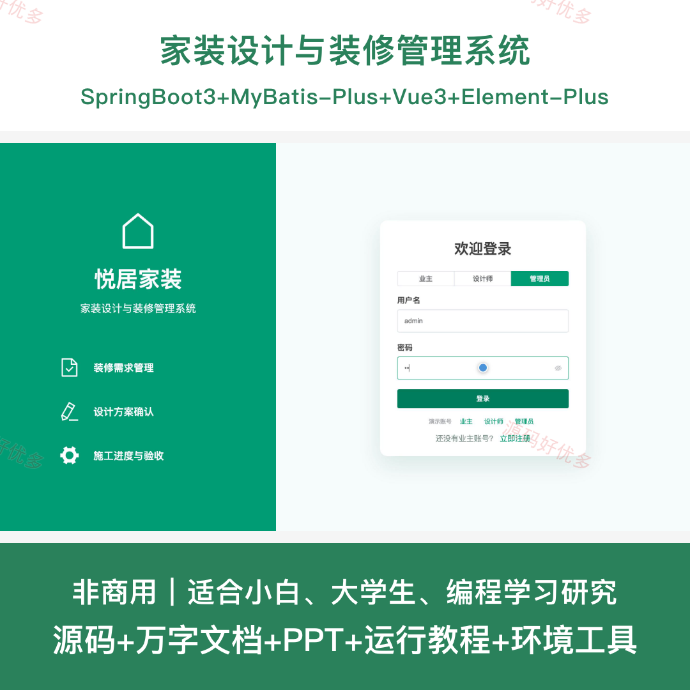
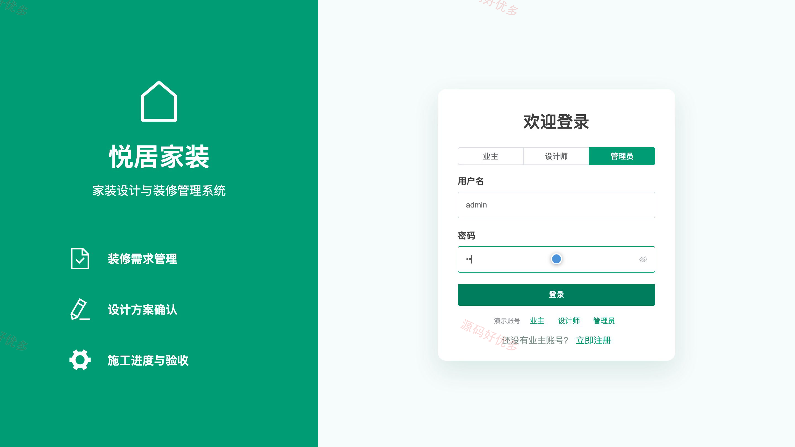
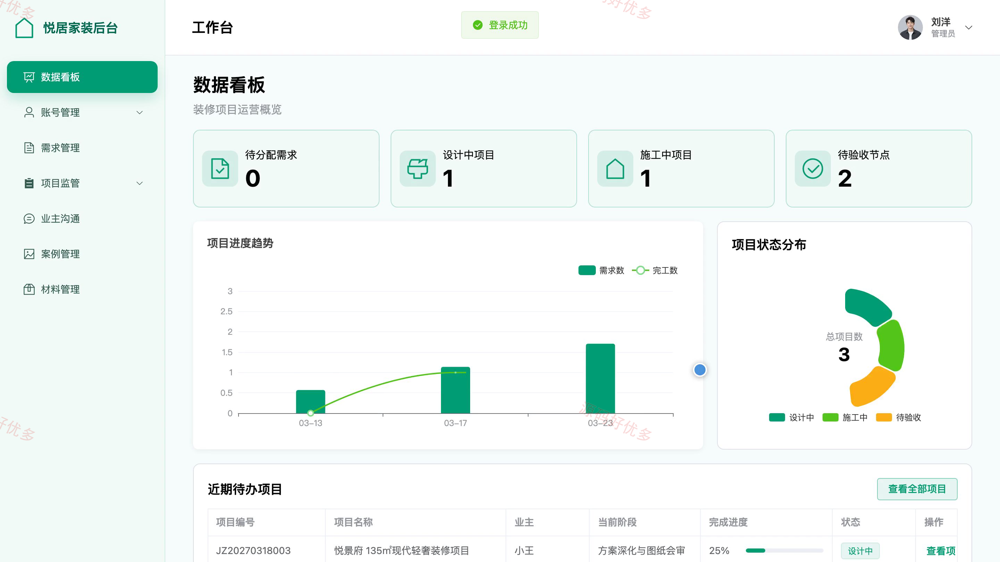
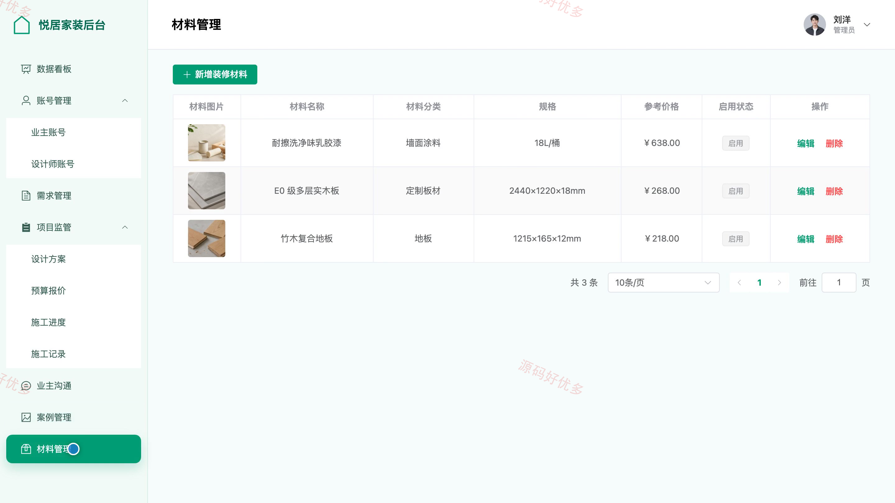
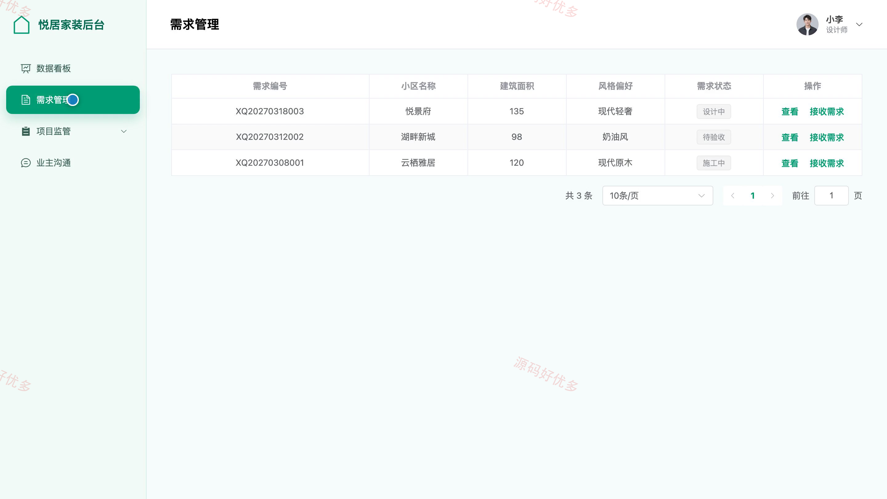

# bs093A
bs093A家装设计与装修管理系统
## 源码问题查看主页咨询

### 一、关键词
家装设计、装修管理、装修报价、施工进度、节点验收

### 二、作品包含
源码+数据库+万字设计文档+PPT+全套环境和工具资源+本地部署教程

### 三、项目技术
前端技术： Html、Css、Js、Vue3.4、Element-Plus
后端技术：Java、SpringBoot3.2.0、MyBatis-Plus

### 四、运行环境（以下版本亲测，其他版本兼容性请自行测试）
开发工具：IDEA/eclipse + VSCODE

数据库：MySQL5.7+（共15张表）

数据库管理工具：Navicat10以上版本

环境配置软件： JDK17 + Maven

前端Nodejs：16+

浏览器：谷歌浏览器

### 五、项目介绍
项目编号：bs093A

系统面向业主、设计师和管理员，围绕装修需求、设计方案、预算报价、施工进度与节点验收形成完整业务闭环，并支持装修案例、材料信息和项目过程监管。

角色：业主、设计师、管理员

业主功能：账号注册与登录、装修需求提交、装修案例查看、设计方案查看与确认、预算报价查看与反馈、施工进度跟踪、节点验收反馈、个人资料与密码维护。

设计师功能：数据看板查看、装修需求接单、设计方案维护、预算报价编制、施工阶段编排、施工记录更新、业主沟通与反馈处理、个人资料维护。

管理员功能：平台数据统计、业主与设计师账号管理、装修需求审核与分配、设计方案与报价监管、施工项目过程监管、装修案例管理、装修材料管理、公告信息管理。

### 六、运行截图

